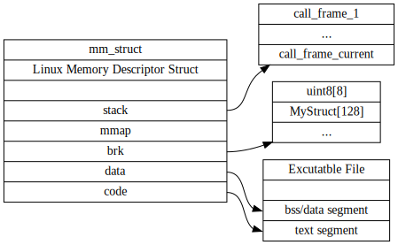
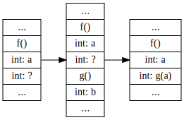
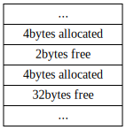
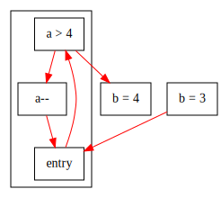

程序执行只需要关心两点: 数据/变量怎样变动, 控制/步骤怎么进行.

编程语言的内存管理是区分不同语言的一大特性, 尤其是在并发环境下, 内存模型变得尤为重要; 且理解内存管理不可避免要对硬件和操作系统有所了解, 是数据流动的重点.

数据流和控制流是两个适用于所有编程语言的抽象概念, 描述了程序怎样执行, 一般用图来展示, 是分析程序执行逻辑的工具. SSA形式提供了一种稀疏的分析型表示, 帮助分析控制流动.

## 内存管理

**操作系统(operating system)** [^os]是硬件和软件交界点, 它隐藏硬件实现, 为程序提供一个统一的运行环境. 程序的运行是受操作系统管制的, 一般是作为一个 **进程(process)**.

[^os]: [百度百科](//baike.baidu.com/item/%E6%93%8D%E4%BD%9C%E7%B3%BB%E7%BB%9F/192?fr=aladdin)

现代操作系统和硬件都具有 **虚拟内存(virtual memory)** [^vmem]机制, 每个进程, 或者说每个程序有自己独立的内存空间. 你不需要知道物理内存是怎么样的, 你只需要, 也只能知道, 你有一段内存可用. 你的内存在物理内存上是否连续, 是否存在都是不可知的.

[^vmem]: [百度百科](https://baike.baidu.com/item/%E8%99%9A%E6%8B%9F%E5%86%85%E5%AD%98/101812?fr=aladdin)

下图是一个linux进程的内存空间的结构体:



你可以看到, 这个进程的内存, 是分成很多段的. stack对应程序的 **栈(stack)** 空间; brk也就是 **堆(heap)** , 对应程序使用malloc向操作系统申请的内存空间; data/code对应程序本身, 可执行文件也需要被加载进内存.

虽然进程的内存空间很多, 但大部分时候, 能直接控制的只有堆栈这两段.

### 栈

栈主要是用来支持函数调用的, 为临时变量提供空间.

整个过程由编译好的程序自己完成, 不需要你参与, 栈空间是 **自动** 管理的.

而且栈空间完全由程序自己控制, 不需要进行系统调用, 不需要通知操作系统就能分配/释放空间. 不过栈空间的大小是有限制的, 譬如glibc规定每个线程可用2MB栈空间, 需要的话会自动增长到8MB.

```c
int g(int b) {
	return b + 1;
}

int f() {
	int a = 3;
	return g(a);
}

f();
```

下图展示, 执行以上代码时栈空间的变化:



f刚开始执行后, 栈上分配了两个int的空间: 一个是变量a, 一个是函数g的返回值.

当g开始执行时, 栈上分配了一个int: 函数g的变量b.

当g执行完成后, g分配的一个int内存被收回, f分配的返回值int被放上了g执行完成的结果.

另外, 上图只是用于理解, 和现实情况有出入:

1. 现代cpu都是有 **寄存器(register)** 的, 函数调用时需要保存寄存器状态.
2. 上述程序不需要分配三个int, 只需要一个int的空间就可以完成, 编译器会对这种情况进行优化. 如果使用寄存器, 甚至都不会在栈上分配内存.

栈空间的分配从函数调用开始, 到函数返回释放, 他的 **生命周期(lifetime)** 和他所在函数是相同的. 如果你返回一个栈上变量的指针:

```c
int* f() {
	int a = 3;
	return &a;
}
```

那么在f调用后, 变量a的空间就已经被回收. 而指针却指向了已经被回收的内存, 这明显是有问题的.

但有时候我们确实有这种需要, 你可以把变量放在函数f外, 它的生命周期自然比函数要长, 不会因为调用f就回收空间.

或者, 我们可以用堆.

### 堆

如果你想要一些变量, 比函数有更长的生命周期, 或者换句话说, 你想要完全掌握变量的生命周期, 这就是堆的用武之地了.

```c
int* f() {
	int* a = malloc(sizeof int);
	return a;
}

free(f());
```

上述代码使用了`void *malloc(size_t size)`函数, 这个函数来自于头文件`stdlib.h`. 给它一个大小(单位是字节), 它就向操作系统申请一块堆上的内存, 并且把地址返回给你. 它的生命周期到你主动调用`free(void *)`释放这个空间为止.

如果你不调用, 就会产生 **内存泄露(memory leak)**: 你在堆上申请的内存会越来越大, 不释放就不会变小, 导致占用大量内存. 这种情况持续到程序退出为止: 现代的OS会在程序退出时, 把你申请的内存全部释放, 尽管你不太应该依赖这个行为.

堆的分配是由`malloc`和操作系统共同管理的, 每次申请都会产生一次系统调用, 你只需要告诉它你需要多大的内存, 只要你系统还有那么多内存. 堆空间的使用很方便, 泛用性非常强.

但正是因为操作系统和`malloc`只知道大小, 而不了解你具体的执行流程, 他的分配无法做到栈上内存那样"按需分配", 不可避免的会产生碎片.

比如如下情况, 两个4字节都分配了, 中间有2字节空闲, 尾部有32字节空闲:



要想再申请8字节空闲, 就只能从尾部的32字节空间分配, 中间的2字节虽然存在 但是却不能用, 这是 **外碎片(external fragment)**.

堆分配严重依赖于`malloc`的实现, 通常说的 **内存分配器(memory allocator)** 指的就是malloc. malloc一方面来自于c标准库的实现libc, glibc有ptmalloc, bsdlibc有omalloc. 但也有一些现代的malloc实现: jemalloc, tcmalloc等.

### 垃圾回收

python是一门有 **垃圾回收(garbage collection)** 的语言. 之前说过堆内存分配是需要全部手动来控制的, 这让你能够针对性的进行优化, 但也增加了内存管理的复杂性. 垃圾回收皆在把栈一样的全自动内存管理体验带到堆上来.

你可能想问如果栈是全自动的话, 还要堆做什么? 主要有两点:

1. 大小限制. 栈空间的大小限制由libc/crt决定, 一般只有几MB: 堆空间由libc/os决定, 只要你还有空闲内存, 一般就能申请成功.
2. 分配受不受os管制. 栈空间的分配不经过os系统调用, 而是一条汇编指令, 相当廉价, 它就适合函数的小变量; 堆空间能申请到更大的内存, 但每次都有系统调用, 申请速度慢得多.

在python中, 你从来不需要担心一个变量的内存需不需要回收, 不管它是在堆上, 还是在栈上:

```py
a = []
b = 3
a = b # [] is released
```

实际上python所有的对象(object)都在堆上, 而栈上只存了一个引用. python有一个专门的内存分配器, 来管理对象的分配. 而像`34`这样的整数是直接存储在栈上的.

垃圾回收算法一般有这么几个话题:

1. 标记问题: 如三色标记法.
2. 分代回收
3. 引用计数: 另类的标记方法

### 内存对齐

因为CPU访问对齐后的内存(大小为二次幂)比较快, 所以分配的内存也对齐比较好. 申请3字节, 使用4字节, 甚至是8字节会更好. 堆栈都存在这种问题.

主要表现为:

1. 结构体大小, 不等于结构体成员大小之和, 为了对齐存在 **padding**.
2. `malloc`申请的内存比申请大小要大, 浪费了的多余空间, 被叫做 **内碎片(internal fragment)**.

### 练习

1 . (normal) c语言结构体内存对齐的例子.

2 . (normal) 你能访问回收后栈空间吗?

## 数据流/控制流

下图以一个简单c语言程序展示:

```c
int a = 1;
if (a > 5)
	a = a + 1;
else
	a = a - 1;
```


我们用红色箭头标识控制的传递, 黑色箭头表示数据的流动. 数据的流动是指各个常量, 变量从哪一个存储空间, 转移到了另一个存储空间; 而控制的传递是指, 什么时候应该根据什么条件执行什么操作, 执行完成后应该接着执行哪个控制逻辑.

注意, 执行流是从上到下的红色箭头, 数据流是从下到上的黑色箭头. 以上图为例, 程序首先从最顶部`a_0 = 1`开始, 对应源程序`a = 1`.

通过红色箭头, 传递控制到分支`a_0 > 5`, 对应源程序`if (a > 5)`. 需要a的数据和5的数据进行比较, 所以有从下倒上指向5黑色箭头, 指向`a_0 = 1`的双向红色箭头.

源程序中, 当`a > 5`时, 才会去执行`a = a + 1`, 反之执行`a = a - 1`. 对应到图中, `a_0 > 5`时, 从红色箭头指向`a_1 = a_0 + 1`这一支走, 否则从`a_2 = a_0 + 1`这一支走.

最后两个分支都通过红色箭头, 传递控制到`a_3 = phi(a_1, a_2)`. 这是属于SSA[^ssa]形式的`phi()`函数. 通俗的讲, 当程序的控制从`a_1 = a_0 + 1`传递到`a_3 = phi(a_1, a_2)`时, `a_3 = a_1`; 当程序的控制从`a_2 = a_0 - 1`传递到`a_3 = phi(a_1, a_2)`时, `a_3 = a_2`.

[^ssa]: [静态单一赋值](//zhuanlan.zhihu.com/p/57787118), [SSA - wikipedia](//en.wikipedia.org/wiki/Static_single_assignment_form), 两个参考

下面拆分本图, 分开介绍不同的组成元素.

### 赋值(assignment) & 表达式(expression)

```c
a = 3 + 4;
```


将一个常量, 变量从一个地方, 转储到另一个地方. 用黑色箭头, 从起始指向目的.


为简化作图, 突出重点, 表达式计算, 比如`3 + 4`这类四则运算, 可以合并到一个区块内. 同理, 其他区块, 也有类似简写标记, 逻辑清晰即可, 不作强制要求.

### 跳转(jump)

```c
a = 3;
a = a + 1;
```


跳转, 是控制转移的另一种说法: 从一个控制逻辑, 跳转到另一个控制逻辑; 从一条指令, 跳转到下一条指令; 从这一行代码, 跳转到下一行代码. 当然跳转不只可以是从这一行到下一行, 还可以跳转七八行(c语言中的`goto`).

为统一, 全部使用红色箭头, 从当前指令, 指向下一条要执行指令.

### 分支(branch)

```c
switch (a) {
case 1:
	b = 1;
	break;
case 2:
	b = 2;
	break;
case 3:
	b = 3;
	break;
// more branches
}
```


分支不外乎接受n个参数, 计算后跳转到m不同指令. 比如c语言中的`if (cond)`, 就是接受`cond`表达式, 或者`cond`变量, 进入本分支, 或另一个分支. 而上图给出了, c语言中switch分支例子.

### 代码块(block)

```c
a = 3;
if (a > 4) {
	b = 1;
	c = 2;
}
```


我们也经常把相关的逻辑划分到一块, 对应到图中就是, 将相关部分用大方块括起来. 你可以上图的方块当成一个函数:

```c
void f(int a) {
	if (a > 4) {
		b = 1;
		c = 2;
	}
}
```

当然, b和c在这种情况下是全局变量. 我们说跳转到一个区块的时候, 其实是跳转区块第一行代码, 所以规定一个区块必须有一个起始点: `entry`. 见下一节循环的例子.

### 循环

```c
b = 3
while (a > 4)
	a--;
b = 4;
```



用图例表示一个while循环, `b=3`是程序开始执行起点, `entry`是循环区块的起点. 只要`a > 4`, 此分支就跳转到`a--`, 否则跳转到`b=4`. 你可能注意到, 这张图中我并没有写类似`a_0`, `a_1`这样的变量名称, 这也是SSA[^ssa]形式的一部分. 但SSA难以快速理解, 所以只留一道hard的思考/练习题. 现实中SSA的图例可以参照libfirm[^libfirm].

[^libfirm]: [libfirm](//pp.ipd.kit.edu/firm/GraphSnippets.html)

### 练习

1 . (easy) 画出下列程序的框图:

```c
int a = 3;
int b = 5;
if (b < 6) {
	b = 4
	a = a + b
}
```

要求使用代码块框起`{}`包围的部分.

2 . (easy) 画出下列程序的框图:

```c
int b = 0;
for (int i=0;i<10;i++)
	b++;
```

3 . (easy) 编程中的函数是什么东西? 你能画出下列函数的框图吗?

```c
void f1(int a) {
	a = a + 1;
}

void f2(int a, int b) {
	a = a + b;
}

int f3(int a, int b) {
	return a + b;
}
```

4 . (easy) 你能把1, 2题中的c程序, 改写成python程序吗?

5 . (normal) 画出下列程序的框图:

```c
int b = 0;
for (int i=0;i<10;i++) {
	b++;
	if (b > 5)
		break;
}
```

6 . (normal) 能把3, 5题中的c程序, 改写成python程序吗?

7 . (normal) 下列程序运行结果是什么?

```c
include <stdint.h>
include <stdio.h>

int main() {
	uint16_t a = 0x0102;
	printf("%d", (uint8_t)a);
	return 0;
}
```

是0x0102, 0x02, 0x01, 还是0x0201? 为什么?

提示: 尝试结合数据和解释一节, uint16_t为16bits, uint8_t为8bits

8 . (normal) 什么是递归, 你能写出一个递归函数吗?

9 . (hard) 什么是SSA形式, 有什么用(简要理解概念即可)?

10 . (hard) 你能画出下面程序的SSA形式框图吗:

```c
a = 5
while (a > 0)
	a--;
a = 4;
```
