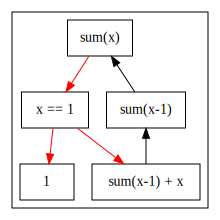
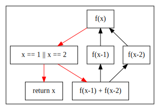

## 递归

函数是接受输入, 给定输出的一个过程:

```py
def add(x, y):
	return x + y
```

最初的目的是提取经常重复写的代码, 为它起个名字, 这样不用一遍一遍写. 第一节控制流小节说的代码块可以看成函数, 就是这个意思. 如果你把一个代码块提出来, 起个名字, 那其实就和函数一样了. 函数后来进一步拓展出**作用域**, **形参/实参**, **递归**等衍生话题.

大多语言只允许返回一个返回值, 有些语言(go语言)允许返回多个返回值. 到这里, 函数已经完全不像原本的数学中的函数的定义了, 务必不要拿数学的函数来理解程序的函数.

这一节主要讲递归:

```py
def sum(x):
	if x == 1:
		return 1
	return sum(x - 1) + x
```

你不要知道栈, 就能理解递归. 假设函数:

$$
sum(x) = \sum _ {i=1}^x i
$$

可得

$$
sum(x) = \sum _ {i=1}^{x-1} i + x
= sum(x-1) + x \quad x > 1
$$

这是对应的数学表示, 第二个递推式只在$x > 1$时成立. 现在来看看它对应的程序框图:



这个框图$x \neq 1$的时候, 完美的反应了递推式. 递推式只有在$x > 1$时成立, 因此, 我们在x减少到$x = 1$时, 不再使用递推关系, 而是直接返回$1$. 因为$sum(1) = 1$.

可以说递归的核心就是:

1. 大问题化小问题
2. 通过递归调用解决小问题
3. 额外几步计算, 通过小问题的答案给出大问题的答案

而递推就是一个典型的可以这么做的情况. 动态规划这类算法问题就常写出递推公式, 所以动态规划的问题可以用递归解决.

至于为什么可以这样写, 递归的时候数据是怎么流动的, 之后几节再说. 现在来看看斐波那契的例子:

```py
def fib(x):
	if x == 1 or x == 2:
		return 1
	return fib(x-1) + fib(x-2)
```

对应的递推公式:

$$
f(1) = 1
\\
f(2) = 1
\\
f(x) = f(x-1) + f(x-2) \quad x > 2
$$

有n级楼梯, 可以1次跨一级台阶, 或1次二级台阶, 有多少种爬法? 对应的递推公式:

$$
f(1) = 1
\\
f(2) = 1 + 1 = 2
\\
f(n) = f(n-1) + f(n-2)
$$

你可以看到这个公式就是fibnacci.

这个问题可以到着来思考, 假设你已经站在第n级. 爬楼梯要么一级, 要么两级, 所以要么是从n-1级迈一步到n级, 要么是直接从n-2跨两级到n级.

所以从n-1到n只有一种爬法, n-2级到n级只有一种爬法. 假设你已经知道, n-1级的爬法次数, 还有n-2级的爬法次数, 相加即得到n级的爬法次数.

你可能会说n-2到n级, 还可以迈两次两个一级, 那种情况迈一级之后就变成n-1到n级的情况, 已经重叠了, 所以不需要重复考虑.

### 练习

1 . (easy) 本节中的爬楼梯, 写出代码, 画出程序框图

有n级楼梯, 可以1次跨一级台阶, 或1次二级台阶, 有多少种爬法?

**答案**:

此处有[leetcode 原题](//leetcode-cn.com/problems/climbing-stairs/)

c写法:

```c
int f(int n) {
	if (n == 1 || n == 2) return n;
	return f(n-1) + f(n-2);
}

printf("res = %d\n", f(3));
// res = 3
```

py写法:

```python
def f(n):
	if n == 1 or n == 2:
		return n
	return f(n-1) + f(n-2)

print("res = ", f(3));
 res = 3
```

框图:



2 . (easy) 阶乘$f(x) = x!$, 写出代码

递推式:

$$
f(1) = 1
\\
f(x) = f(x-1) * x \quad x > 1
$$

c写法:

```c
int f(int n) {
	if (n == 1) return n;
	return f(n-1) * n;
}

printf("res = %d\n", f(3));
// res = 6
```

py写法:

```python
def f(n):
	if n == 1:
		return 1
	return f(n-1) * n

print("res = ", f(3))
 res = 6
```

3 . (easy) 有n级楼梯, 可以1次跨一级,二级,三级台阶, 有多少种爬法? 求代码

递推式:

$$
f(1) = 1
\\
f(2) = 2
\\
f(3) = 4
\\
f(x) = f(x-1) + f(x-2) + f(x-3) \quad x > 3
$$

跨一级只有一种走法, 跨两级有$1+1$和$2$两种走法. 跨三级: $1+1+1$, $1+2$, $2+1$, $3$.

c写法:

```c
int f(int n) {
	if (n == 1) return 1;
	if (n == 2) return 2;
	if (n == 3) return 4;
	return f(n-1) + f(n-2) + f(n-3);
}

printf("res = %d\n", f(4));
// res = 7
```

py写法:

```python
def f(n):
	if n == 1:
		return 1
	if n == 2:
		return 2
	if n == 3:
		return 4
	return f(n-1) + f(n-2) + f(n-3)

print("res = ", f(4))
 res = 7
```

4 . (easy) 有n级楼梯, 可以1次跨一级,三级台阶, 有多少种爬法? 写出代码

递推式:

$$
f(1) = 1
\\
f(2) = 1
\\
f(3) = 2
\\
f(x) = f(x-1) + f(x-3) \quad x > 3
$$

跨一级只有一种走法, 跨两级: $1+1$, 跨三级: $1+1+1$, $3$.

c写法:

```c
int f(int n) {
	if (n == 1 || n == 2) return 1;
	if (n == 3) return 2;
	return f(n-1) + f(n-3);
}

printf("res = %d\n", f(4));
// res = 3
```

py写法:

```python
def f(n):
	if n == 1 or n == 2:
		return 1
	if n == 3:
		return 2
	return f(n-1) + f(n-3)

print("res = ", f(4))
 res = 3
```

5 . (normal) 求杨辉三角, 第m行, 第n个数字(m/n从0开始)? 写出代码

递推式, 杨辉三角的某个数等于上一行左右两个数之和:

$$
f(m, n) = 1 \text{ if } n = 0
\\
f(m, n) = 1 \text{ if } m = n
\\
f(m, n) = f(m-1, n-1) + f(m-1, n) \text{ if }  n > 0 \cap m > 0
$$

c写法:

```c
int f(int m, int n) {
	if (n == 0 || m == n) return 1;
	return f(m-1, n-1) + f(m-1, n);
}

printf("res = %d\n", f(4, 3)); // 第五行第四个
// res = 4
```

py写法:

```c
def f(m, n):
	if n == 0 or m == n:
		return 1
	return f(m-1, n-1) + f(m-1, n)

print("res = ", f(4, 3))
" res = 4
```

6 . (normal) 从n个球中取出m个$C_n^m$，一共有多少可能性? 写出代码

递推式:

$$
C_n^m = 1 \text { if } n = m
\\
C_n^m = \frac{n!}{m!(n-m)!}
\\
= \frac{(n-1)!}{m!(n-1-m)!} \times \frac{n}{n-m}
\\
= C _ {n-1}^m \times \frac{n}{n-m} \text{ if } n-1 \geq m
$$

c写法:

```c
int f(int n, int m) {
	if (n == m) return 1;
	return f(n-1, m) * n / (n-m);
}

printf("res = %d\n", f(4, 3));
// res = 4
```

py写法:

```python
def f(n, m):
	if n == m:
		return 1
	return f(n-1, m) * n / (n-m)

print("res = ", f(4, 3))
" res = 4.0
```

7 . (normal) 汉诺塔最少移动次数, 写出代码

三个柱子：A, B, C. A柱子上有n个环，将n个环全部移动到C上最少移动次数. (大环不能放在小环上, A柱子上的环符合本要求)

**答案**:

一个环可直接移动.

两个环需要先将小的从A移动到B上, 大的从A移动到C上, 最后小的从B到C, 一共3次.

考虑有3个环, 我们需要先将前两个从A移动到B, 第三个从A移动到C上, 最后前两个从B到C, 一共$3 + 1 + 3 = 7$次. 这其中, 前两个从A移动到B, 从B移动到C的过程, 和两个环A移动到C的步骤是高度相似的.

考虑n个环, 将前n-1个从A移动到B, 第n个从A移动到C, 最后前n-1个B移动到C. 如果忽略第n个环, 你可以认识到将n-1个环从A移动到B, 从B移动到C的过程是一样的, 只是起始柱子, 目的柱子, 用来临时放环的空闲柱子不同而已.

因此, 可以得出递推式:

$$
f(1) = 1
\\
f(n) = f(n-1) * 2 + 1 \text{ if } n > 1
$$

为什么是最少呢? 因为若想将第n个环挪到C上, 第n个环上必然没有其他环, 且C上也没有其他环(第n个环是最大的). 所以要想实现这个过程, 必定需要将前n-1个环挪动到B上, 才能开始挪动第n个环, 而挪动第n个环后, 也只剩挪动前n-1个环到C上一种操作. 因此, 操作方法是唯一的(排除你一直小环来回挪不做正事的可能性), 所以也一定是最少的.

c写法:

```c
int f(int n) {
	if (n == 1) return 1;
	return f(n-1) * 2 + 1;
}

printf("res = %d\n", f(4));
// res = 15
```

py写法:

```python
def f(n):
	if n == 1:
		return 1
	return f(n-1) * 2 + 1

print("res = ", f(4))
" res = 15
```

8 . (hard) 爬楼梯的递归代码中存在重复计算吗? 可以在仍然使用递归的方法下避免重复计算吗? 若可以, 给出代码

存在, 可以避免.

c写法:

```c
int computed[1024] = {1, 2, 0};

int f(int n) {
	if (computed[n] != 0) return computed[n];
	int r = f(n-1) + f(n-2);
	computed[n] = r;
	return r;
}

printf("res = %d\n", f(3));
// res = 3
```

9 . (hard) 下面的c语言代码是不是未定义行为? 为什么

```c
int a[3] = {1, 2, 3};
int i = 1;
a[i++] = i;
```

**答案**:

是. 根据c语言标准, `a[i++] = i;`只有两个序列点, 赋值`=`和`;`. 赋值后直接通过`;`结束语句, 这两个序列点之间没有其他操作, 所以不存在问题(`a=3,c=4;`这样写就有其他操作了).

在向数组赋值前, 需要计算`i++`和`i`的值, 但因为赋值前没有其他序列点, 所以`i++`和`i`的求值顺序不确定先后, 而且本行为未定义.

这行代码可能执行为`a[2] = 1`, 也可能是`a[1] = 2`, 或者直接让你的电脑死机, 这都是执行预期内的行为.

10 . (hard) 补完下列c程序:

```c
int sum(int a) {
	// 写出代码
}
```

函数接受参数a, 返回结果$sum(a) = \sum_{i=1}^a i$, 只许使用递归, 变量, `&&`, `||`, `==`, `=`, `+`, `-`.

提示: 试画出`&&`和`||`的程序框图.

**答案**:

```c
int sum(int a) {
	int r = 1;
	a == 1 || (r = sum(a-1) + a);
	return r;
}
```

## 树

正在写...
