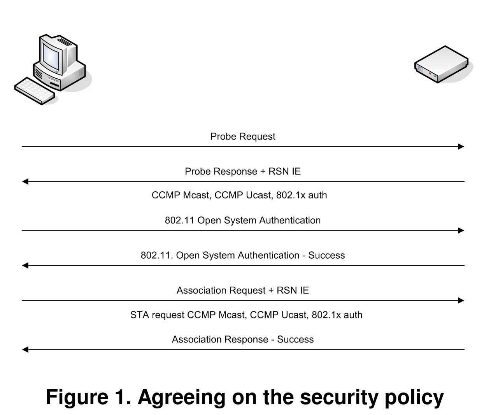
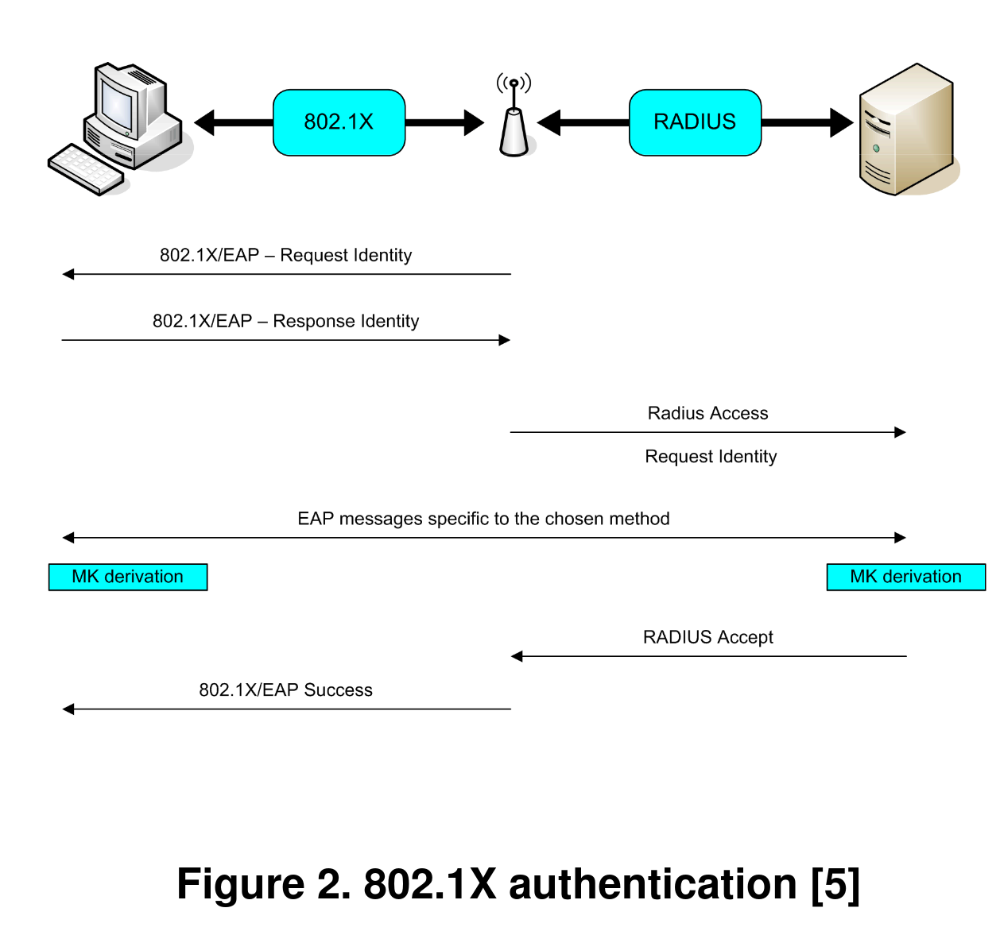
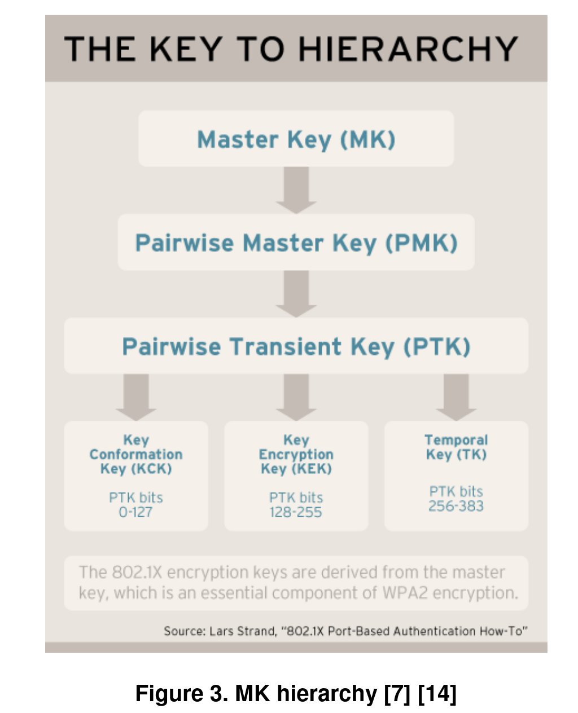
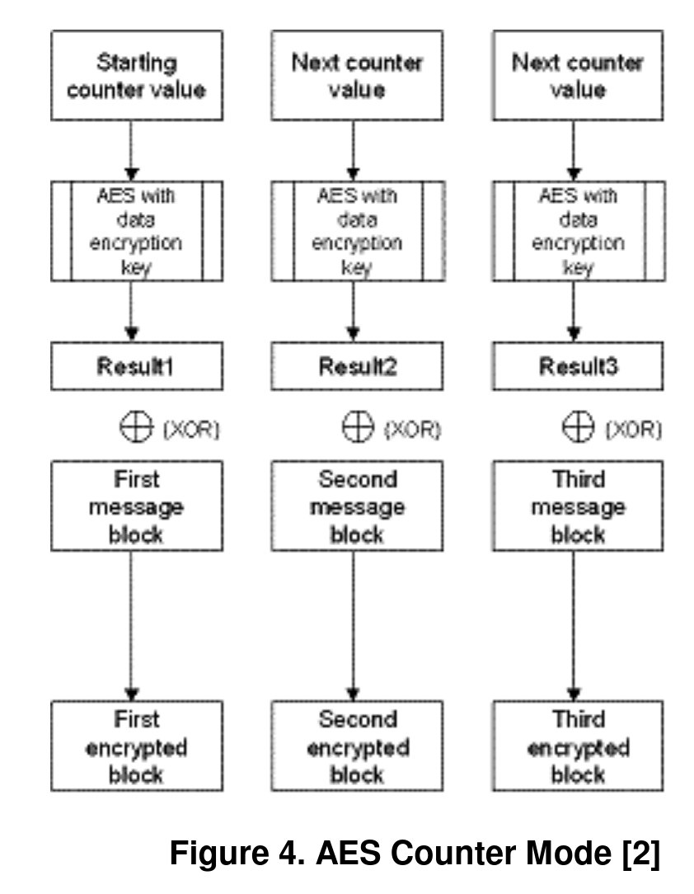
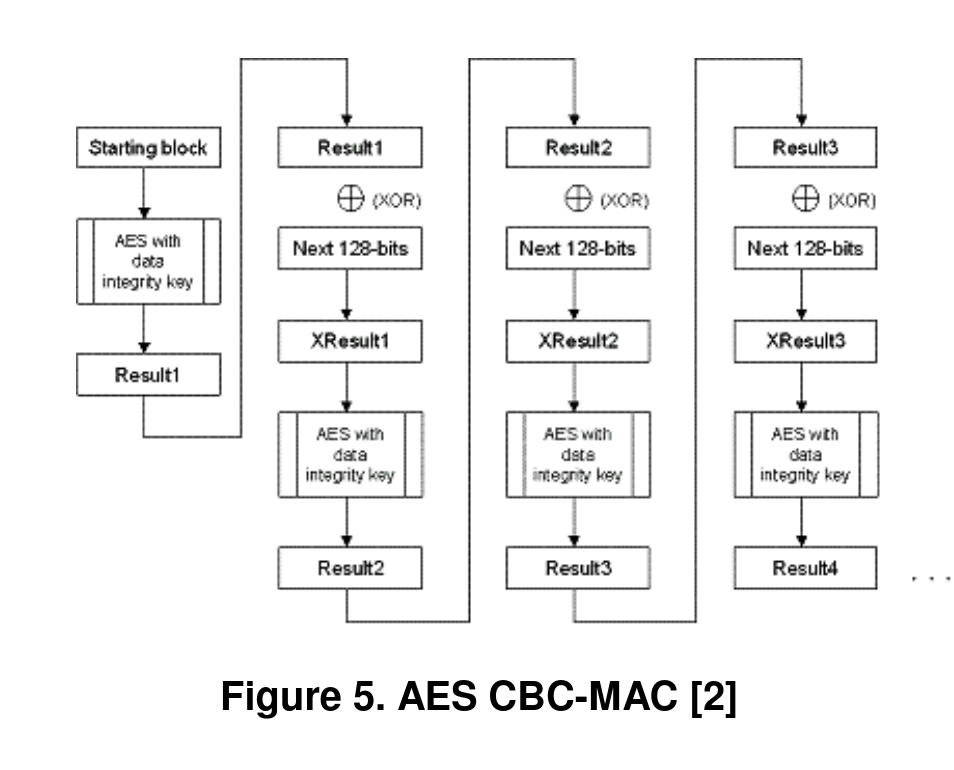
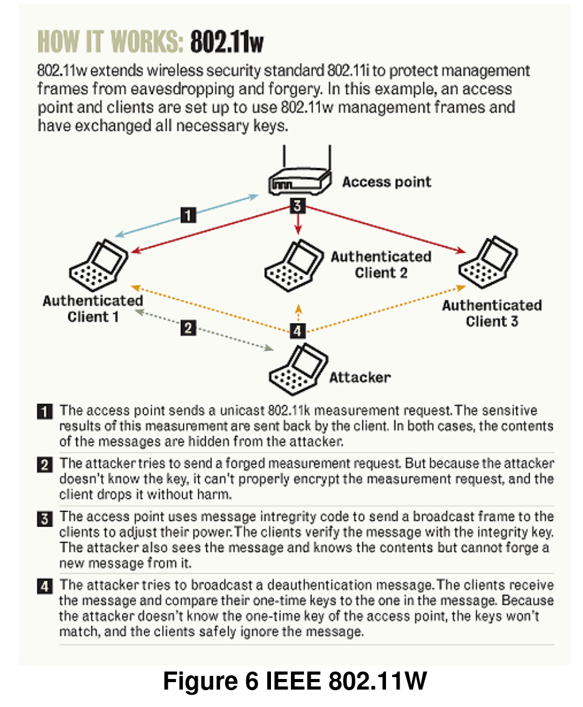

原文: [Benefits and Vulnerabilities of Wi-Fi Protected Access 2 (WPA2)](https://cs.gmu.edu/~yhwang1/INFS612/Sample_Projects/Fall_06_GPN_6_Final_Report.pdf)

## 摘要

随着无线网络的广泛应用, 最初用来保证无线通信安全的协议 *Wireless Access (WEP)* , 早已被证明有缺陷. 所以一个叫做 *Wi-Fi Protected Access 2 (WPA2)* 的新协议被提出了. 本文首先讨论了Wi-Fi Protected Access 2 (WPA2)协议在无线网络通信方面的优点, 以及它解决的缺陷. 然后讨论可行的 **Wi-Fi Protected Access 2 (WPA2)** 使用模式, 最终讨论它的缺陷. 简而言之, 这篇论文会提出一些Wi-Fi Protected Access 2 (WPA2)缺陷的缓解方式, 或者如何通过一些改进, 一个新协议来解决.

## 简介

**IEEE 802.11i** 标准, 也就是 **Wi-Fi Protected Access 2 (WPA2)** 标准, 是对802.11标准安全机制的一种修补. 草案于2004年6月24日提出, 替代了上一个安全标准, 有着致命安全缺陷的**Wired Equivalent Privacy (WEP)**. 此前 **WiFi Protected Access (WPA)** 被提出来解决WEP的安全隐患. WPA只实现了IEEE 802.11i的一个子集. WPA2使用了 **Advanced Encryption Standard (AES)** 的一个特殊模式: **Counter Mode Cipher Block Chaning-Message Authentication Code (CBC-MAC) protocol (CCMP)** . CCMP既提供了数据加密, 又保证了数据完整. AES比WEP和WPA使用的RC4要安全的多.

## WPA2

WPA2标准分两部分, 加密和验证, 对本地无线局域网都很重要. WPA2的加密过程需要AES (Advanced Encryption Standard), 但也能用TKIP (Temporal Key Integrity Protocol)向后兼容现有WAP硬件. WPA2的验证有两种模式: 个人, 企业.

个人模式需要 **PSK (Pre-Shared Key)** , 不需要用户分步验证. 企业模式需要用户基于 **IEEE 802.1X** 标准, 使用 **Extended EAP (Extensible Authentication Protocol)** , 以下列5个EAP形式进行分步验证: EAP-Transport Layer Security (EAP-TLS), **EAP-tunneled Transport Layer Security (EAP-TTLS)**, Protected EAP vo/EAP-Microsoft's Challenge Handshake Authentication Protocol v2 (PEAPvo/EAP-MSCHAPv2), **Protected EAP v1/EAP-Generic Token Card (PEAPv1/EAP-GTC)**, 以及EAP-Subscriber Identity Module of the Global System of Mobile Communications (EAP-SIM).

企业模式有下列软硬件实现要求:

1. Station, APs(Access Point), 验证服务器都需支持EAP形式选择
2. 一般都选择, 部署基于RADIUS(Remote Authentication Dial In User Service)的验证服务器
3. APs和客户端都需升级WPA2软件

WPA2分四阶段来建立一条安全通信隧道:

1. 在第一阶段, AP和客户端就安全策略(验证方法, 单播数据传输协议, 多播数据传输协议, 以及预验证方法)达成一致. 这些策略都是AP和客户端共同支持的.
2. 在第二阶段(仅限于企业模式), AP和客户端之间使用协定好的验证方法进行802.1X验证, 生成一个 **MK(common Master Key)**.
3. 第三阶段, 创建并维护临时密钥(生命周期有限), 这主要是为了密钥生成和交换.
4. 第四阶段, 之前生成的密钥, 被用来进行数据加密和完整性验证.

### WPA2验证

WPA2标准引入的主要变动之一是数据完整性和加密, 以及用户验证的分离. 因此, WPA2可以提供适合于, 家庭网络和身份平等的公用网络, 更灵活, 健壮的安全架构.

WPA2个人模式的验证, 不需要验证服务器, 是在AP和客户端之间用纯文本的密码(8-63个字符)生成256位的PSK. PSK以及Service Set Identifier, SSID长度, 组成了之后进行密钥生成的 **PMK (Pair-wise Master Key)** 的数学基础.

WPA2企业模式的验证依赖于IEEE 802.1X验证标准. 主要参与部件是, 加入网络的supplicant(客户端), 提供访问控制的authenticator(AP), 进行验证决定的验证服务器(RADIUS). AP把每个虚拟端口划分为两个逻辑端口, 一个供正常服务, 另一个用来验证, 组成 **PAE(Port Acess Entity)**.

PAE的验证端口会一直开着, 过滤验证帧; 而PAE的服务端口只在RADIUS服务器验证成功的时候开启. supplicant和authenticator使用 Layer 2 EAPoL(EAP over LAN) 进行交流. 验证器把 EAPoL信息 转换为 RADIUS信息, 然后转发到RADIUS服务器. 验证服务器(RADIUS), 必须兼容客户端的EAP形式, 接受并且处理验证请求. 一旦验证完成, 客户端和验证器就获得了一个 **MK(Master Key)** 密钥, 如图2所示.

### WPA2密钥生成

WPA2密钥生成可以通过两种握手完成: 用于PTK(Pair-wise Transient Key)或者GTK(Group Transient Key)变种, 的四路握手; 用于GTK刷新的Group Key握手.

四路握手, 通过四条AP和客户端之间的EAPol-Key信息完成, 由AP发起, 完成下列任务:

1. 验证客户端的PMK. PTK的生成需要PMK, 而且和验证方法相关. WPA2个人模式中, PMK从PSK衍生; 对于企业模式, PMK从MK(见图3)衍生.
2. 衍生一个新的PTK, 由三部分组成: 128位的 **KCK(Key Confirmation Key)** 用来检查EAPoL-Key帧的完整性, 128位的 **KEK(Key Encryption Key)**用来加密GTK, 用来加密报文的128位的 **TK(Temporal Key)**.
3. 设置好加密和完整性密钥
4. 加密GTK传输, 由AP使用随机的 **GMK(Group Master Key)** 计算
5. 确认密码算法

Group Key Handshake只用来从主机断开连接, 或者刷新GTK, 用四路握手生成的KEK加密GTK.

### WPA2加密

WPA2使用的AES, 是一个对称密钥算法, 使用固定长度位数为一组的数据的块加密算法[4]. 对称密钥算法使用相同的密钥来进行加密和解密. 在WPA2/802.11i实现中的AES, 明文数据被按块加密(密钥128位), 块之间的加密相互独立, 而不是密钥流作用在数据流上. AES一轮由四阶段组成, 每轮迭代十次.

AES使用 **Counter-Mode/CBC-Mac Protocol(CCMP)**. CCM是是块加密的一个新方法, 使得一把密钥既可以用来加密, 也可以用来验证(且AES初始向量不同). CCM使用的两个底层模式的其中之一, 是 **Counter mode(CTR)** . 如图4所示, 使用 **Cipher Block Chaining Message Authentication Code(CBC-MAC)** 来提供数据加密和完整性验证.

CBC-MAC用来生成加密过程(图5)的验证结果. 这和以前 **Message Integrity Code(MIC)** 的实现不同, 不需要单独的完整性检查算法. 为了进一步加强AES的加密性能, AES还有128位的初始向量(IV).

#### WPA2加密步骤

MIC, 不像WEP/WPA, 和checksum类似, 为802.11头中不可改变的部分提供了数据完整性验证, 防止包被恶意破解, 或窥探加信息. MIC用128位IV计算, 如下所示:

1. IV使用AES和TK加密产生128位结果
2. 128位结果与下128位数据异或
3. 异或结果重复执行步骤1, 步骤2, 直到802.11所有的128块穷尽
4. 最后使用所得前64位来产生MIC

Counter Mode算法加密数据以及MIC(使用CBC-MAC计算). Counter Mode算法也从128位的计数器开始, 像MIC IV一样, 不过计数器总是初始化为1, 而不是数据长度. 这样每个包都使用不同的计数器. 加密步骤如下:

1. 第一次则初始化计数器, 否则加1
2. 前128位使用AES和TK加密产生128位结果
3. 步骤1的结果被异或
4. 数据前128位产生前128位加密块
5. 重复1-4步, 知道所有128位块都被加密
6. 把计数器置0, 使用AES加密, 与MIC异或, 然后附到加密帧最后

#### WPA2解密步骤

解密是反着来的, 总结如下:

1. 计数器计算方式相同
2. 使用Counter-Mode和TK算法, 和步骤1中的结果解密802.11报文
3. 然后使用CBC-MAC算法重新计算MIC, 不符合加密步骤2-3的包被丢弃. 否则, 解密结束, 发往网络栈, 到达客户端.

## WPA2优点

WPA2(以及WPA)解决了WEP的中间人攻击, 验证注入, 验证重演, 密钥碰撞, 弱密码, 包注入, 暴力字典攻击等骇客攻击[4]. 使用政府级别的AES加密, 802.1X/EAP验证, WPA2进一步改善了使用TKIP加密, 802.1X.EAP验证的WPA, 比WEP不完美的加密密钥, 无验证好多了. "AES当前没有已知攻击, 而现有分析表明需要$2^120$次操作破解AES密钥."[4]

除了加密的优点, WPA2增强了两点来支持客户端在不同AP间快速切换:

1. PMK缓存: 允许最近链接过AP的客户端, 快速重联, 而无需重新验证.
2. 预验证: 允许客户端预验证要切换的AP, 而仍然和现有AP保持连接.

PMK缓存支持和预验证功能, 使得WPA2切换AP的时间从一秒多, 骤减到不到0.1s. 这让WPA2也支持延迟敏感的程序, 比如说Citrix video, VoiP了, 以前是不可能的.

## WPA2缺陷

**Dos(Denial of Service)** 攻击, 比如射频干扰(RF jamming), 数据洪灾(data flooding), 2层会话注入, 都是针对可用性的攻击. 没有任何的Wi-Fi安全标准能阻止物理层攻击, 因为他们都是基于2层的. 所以也没有任何安全标准能处理AP失效.

管理帧 - 报告网络拓扑, 管理客户端行为的帧, 并没有被保护, 所以攻击者可以通过这些帧发现网络布局, 试探设备位置, 以便更有效的进行DoS攻击.

控制帧 - 也没有保护, 有利于DoS攻击.

去验证 - 原本是为了强迫客户端重新验证, 结合没有验证的控制帧(用来验证和连接), 使得攻击者可以探测MAC地址[7][15]. 大量去验证可能发生.

断连接 - 原本是为了强迫连接了多个AP的客户端断开连接, 影响包进出客户端的包(细节见[15]).

## 解决方案

集中管理一群可以互相沟通的AP, 可以加固客户端切换AP时的信息, 通过调正射频功率改善可用性. 其他安全考量, 比如位置监控, Wi-Fi 射频覆盖, 也能减少射频干扰风险, 改善可用性.

2005年三月, 成立了一个802.1w工作组. 这个工作组的主要目标是通过保护管理帧来改善无线网络安全性. 解决方案可以识别伪造管理帧, 无关恶意负载, 也就是用来进行如去验证洪灾这类DoS攻击的手段. IEEE 802.11w(如图6)预计2008年4月才推出, 所以最后采用的方式可能变化很大. IEEE 802.1w工作组表示无意保护控制帧.

提出的IEEE 802.11w标准将提供三种类型的保护. 第一个针对单播管理帧 - 用来报告网络拓扑/修改客户端行为, 会拓展AES加密到这些帧上, 提供加密, 防止伪造. 第二个针对广播管理帧 - 用来调整射频属性, 或者开始测量, 将会在尾部附加MIC来保护伪造, 但是不加密, 因为没有附带敏感信息. 第三个针对去验证/断连接帧, 可以用一对一次性密钥(一个AP, 一个客户端), 允许客户端检查去验证是否合法.

## 总结

简而言之, 有一些方法可以防范射频干扰, IEEE 802.11W未来的标准也会拓宽管理帧的保护, 减少DoS攻击的影响. 我希望IEEE 802.11TG考虑加固控制帧, 那就削弱了WPA2/IEEE 802.11X无线网络大部分的缺陷.

总之, 一个方案也许不能完全解决WPA2标准的缺陷, 但可以大大改善总体的安全. 要想让绝大部分的设备升级到IEEE 802.11i/WPA2, 这么一个方案就不可或缺, 毕竟现在大部分网络并非WPA2兼容的. 让所有无线设备升级到最新标准的好处, 必须抵消升级最终需要的开销, 最终为用户和程序提供更高一层的安全防护.

## 参考

1. "IEEE 802.11i." Wikipedia, The Free Encyclopedia. 11 Nov 2006, 10:22 UTC. Wikimedia Foundation, Inc. Nov. 25 2006. [link](http://en.wikipedia.org/w/index.php?title=IEEE_802.11i&oldid=87121019)
2. "Wi-Fi Protected Access 2 Data Encryption and Integrity." Microsoft TechNet. The Cable Guy. July 29 2005. [link](http://www.microsoft.com/technet/community/columns/cableguy/cg0805.mspx)
3. "Understanding the updated WPA and WPA2 standards". ZDNet Blogs. Posted by George Ou. June 2 2005. [link](http://blogs.zdnet.com/Ou/?p=67)
4. "Deploying Wi-Fi Protected Access (WPAtm) and WPA2tm in the Enterprise." Wi-Fi Alliance, Feb. 27 2005[link](http://www.wifi.org/files/uploaded_files/wp_9_WPA-WPA2%20Implementation_2-27-05.pdf)
5. Lehembre, Guillaume. "Wi-Fi security –WEP, WPA and WPA2". Article published in number 1/2006 (14) of hakin9, Jan. 2006. Publication on www.hsc.fr on Dec. 28 2005. [link](http://www.hsc.fr/ressources/articles/hakin9_wifi/hakin9_wifi_EN.pdf)
6. Ou, George. "Wireless LAN security guide". www.lanarchitect.net. Revision 2.0 Jan 3 2005.[link](http://www.lanarchitect.net/Articles/Wireless/SecurityRating)
7. Bulk, Frank. "Learn the basics of WPA2 Wi-Fi security". Network Computing Jan. 27 2006. [link](http://www.informationweek.com/story/showArticle.jhtml?articleID=177105338)
8. "Extensible Authentication Protocol." Wikipedia, The Free Encyclopedia. Nov. 26 2006, 15:39 UTC. Wikimedia Foundation, Inc. Nov 27 2006 [link](http://en.wikipedia.org/w/index.php?title=Extensible_Authentication_Protocol&oldid=90231401).
9. Gupta, Ashok and Buthmann, Theresa. "The Bell Labs Security Framework: Making the case for End-to-End Wi-Fi Security". Lucent Technologies Sep. 11 2006 (15). [link](http://www.lucent.com/livelink/09009403800aa8c9_White_paper.pdf)
10. Epstein, Joe. "802.11w fills wireless security holes". Network World Apr. 3 2006 [link](http://www.networkworld.com/news/tech/2006/040306-80211w-wireless-security.html)
11. Wright, Joshua. "How 802.11w will improve wireless security". Network World May 29 2006 [link](http://www.networkworldcom/columnists/2006/052906-wireless-security.html)
12. Wright, Joshua. "802.11w security won’t block DoS attacks". Tech World Jun. 14 2006 [link](http://www.techworld.com/security/features/index.cfm?featureID=2599&pagetype=samecatsamchan)
13. Sood, Kapil and Eszenyi, Mathew. "Secure Management of IEEE 802.11 Wireless LANs". Intel Software Network [link](http://www3.intel.com/cd/ids/developer/asmo-na/eng/dc/mobile/287462.htm)
14. Strand, Lars. "802.1X Port-Based Authentication HOWTO". The Linux Documentation Project Oct. 18 2004. [link](http://tldp.org/HOWTO/html_single/8021X-HOWTO)
15. Bellardo, John and Savage, Stefan. "802.11 Denial-of-Service Attacks: Real Vulnerabilities and PracticalSolutions" USENIX 2003 Nov. 7 2003 [link](http://www.cse.ucsd.edu/%7Esavage/papers/UsenixSec03.pdf)
